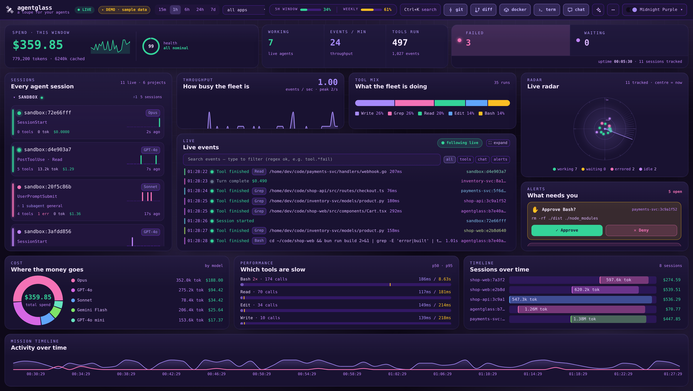
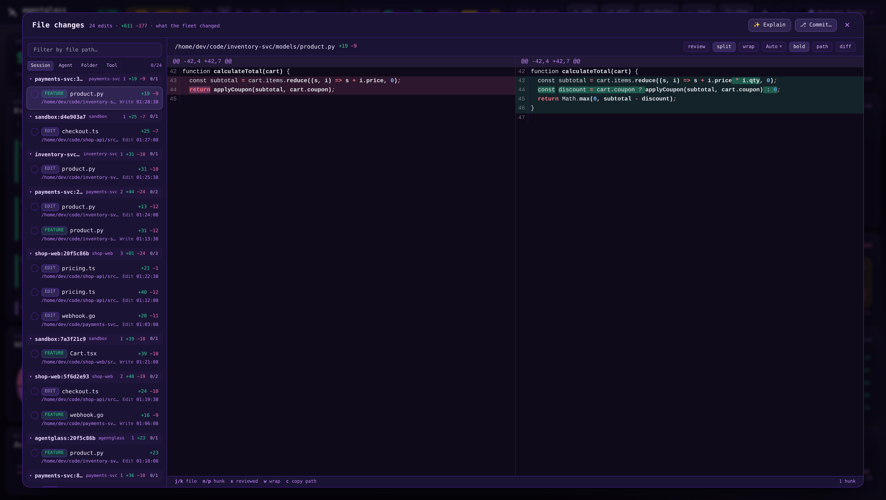
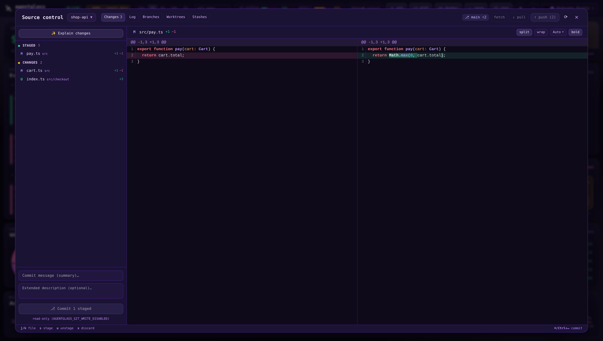
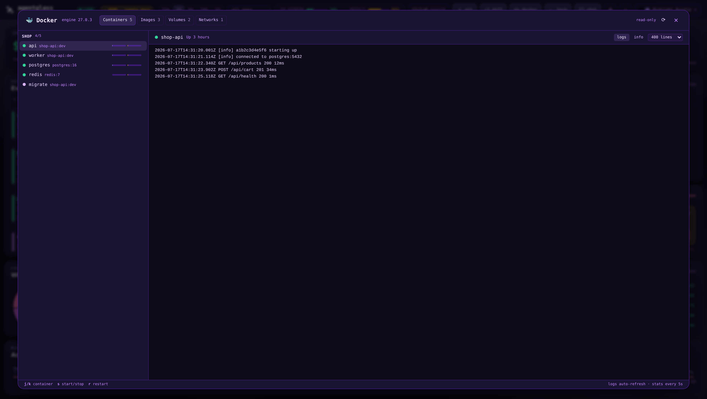
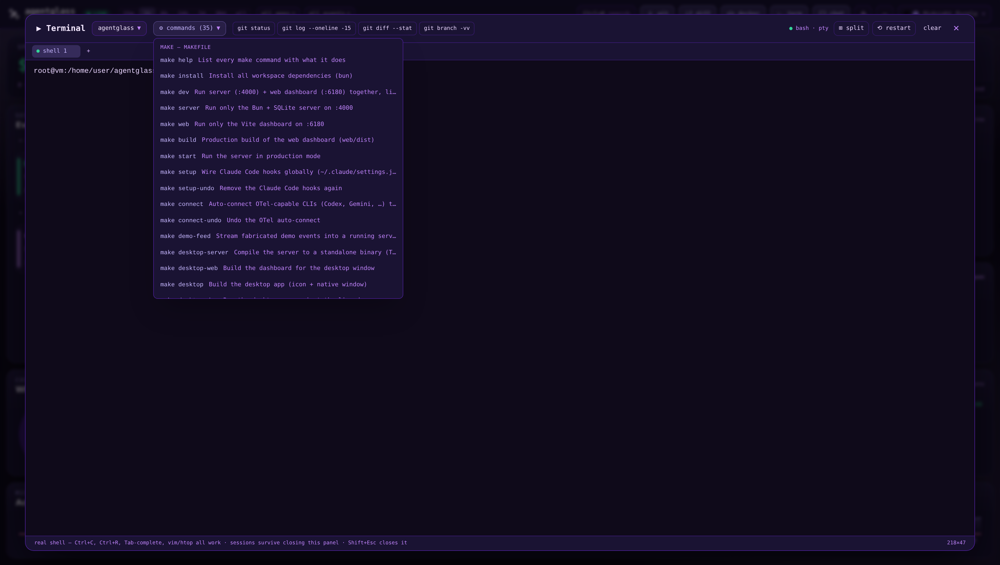
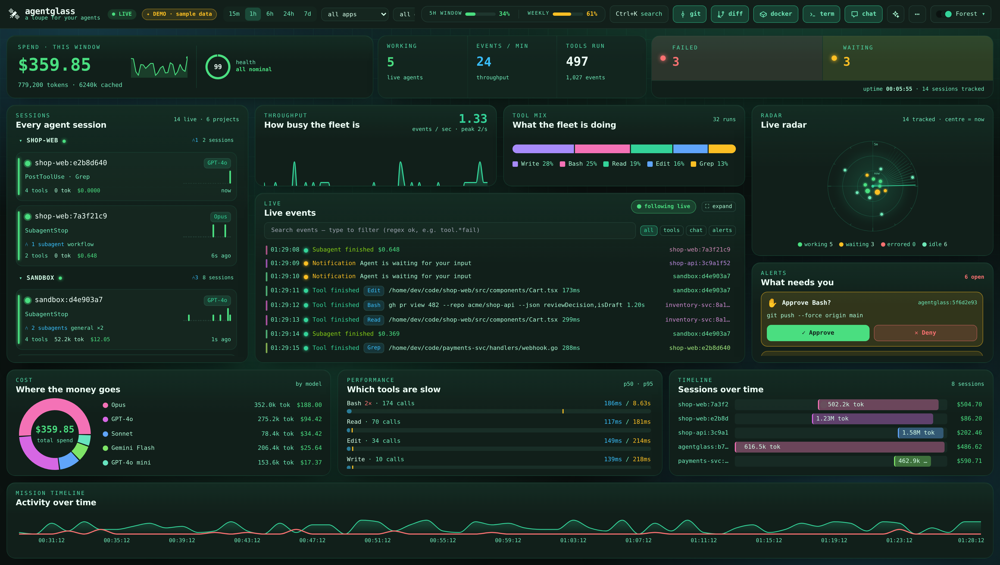
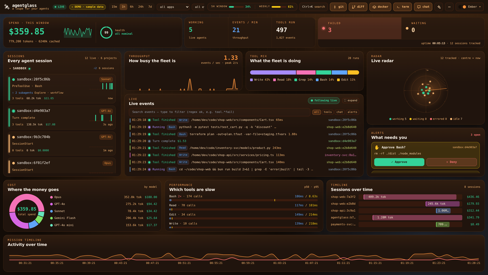
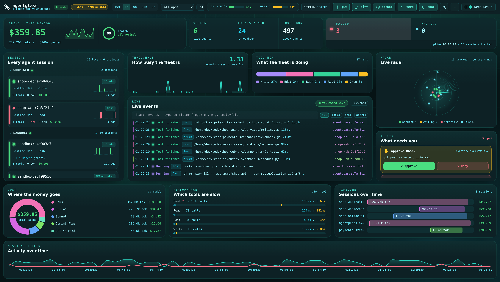
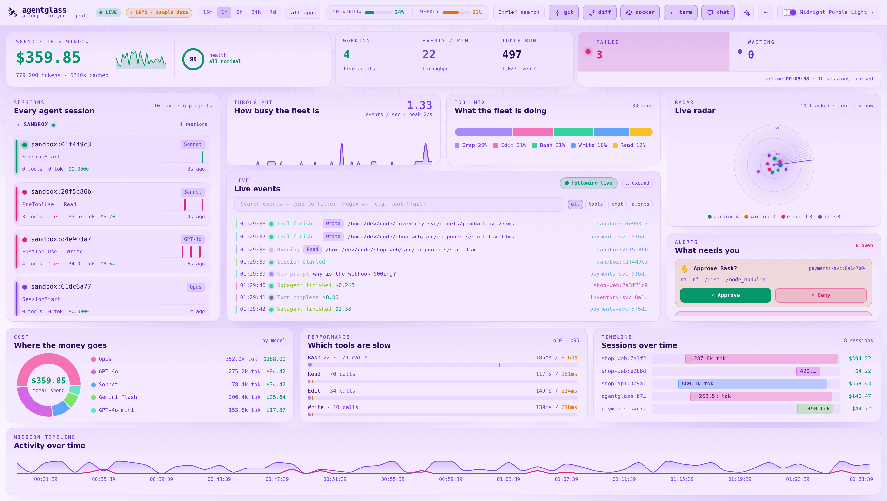

<div align="center">

# 🛰 agentglass

**A loupe for your agents** — a real-time Mission-Control **dashboard _and_ workspace** for AI coding agents, across every provider and every project on your machine.

[](https://sirallap.github.io/agentglass/)

     



</div>

Point any AI coding agent at agentglass — via Claude Code hooks or any OpenTelemetry GenAI exporter (OpenAI Codex, Gemini CLI, Bedrock, LangChain, LiteLLM…) — and watch every agent, tool call, token, and dollar move in real time. Cost tracking, tool-latency percentiles, error timelines, session lifecycles, a filter-the-whole-cockpit-by-provider switch, and 22 themes. It persists across reloads (unlike a pure in-browser stream).

And it's not just a viewer. agentglass carries a full **workspace** in the same cockpit — the idea is simple: browser, terminal, IDE panels, agent telemetry… all in one place. A syntax-highlighted **diff** viewer for everything the fleet changed, a **lazygit**-style source-control panel (stage, commit, push), a **lazydocker**-style Docker panel (containers, logs, stats), a **real terminal** (an actual PTY shell on your machine, not an emulation), and a **chat** panel that drives local Claude Code sessions — each one keystroke away. Runs in the browser or as a **native desktop app**.

### ▶ [**Live demo →**](https://sirallap.github.io/agentglass/)

The full cockpit running on fabricated sample data — a simulated live event
stream, populated radar, spend charts, and even the control-plane approve/deny
gate. No install, no server. *(Everything there is fake; it's a showcase.)*

---

## Contents

- [Every project, one cockpit](#every-project-one-cockpit)
- [More than a dashboard — a workspace](#more-than-a-dashboard--a-workspace)
- [Why](#why) · [Themes](#themes)
- [Quickstart](#quickstart)
- [Desktop app](#desktop-app)
- [Security model — read this before installing](#security-model--read-this-before-installing)
- [Control plane — approve / deny remotely](#control-plane--approve--deny-tool-calls-remotely-opt-in)
- [Any provider — via OpenTelemetry](#any-provider--via-opentelemetry-openai-gemini-bedrock-)
- [Configuration](#configuration-env) · [API](#api) · [Architecture](#architecture)
- [Contributing](#contributing) · [License](#license)

---

## Every project, one cockpit

agentglass watches **every** Claude Code session on your machine — you don't
launch it per-repo. Alongside the live hook stream, a **transcript scanner**
reads `~/.claude/projects` directly, so history from every project is there the
moment you open the dashboard, and new sessions tail in live (deduped against
the hooks, so nothing is double-counted).

Want to focus? **Scope the whole cockpit to a single project** — only that repo
(and its worktrees) show up, and its git / terminal / chat panels, diffs, and
spend are all you see. The natural way is the **in-app project picker**: on
first open (a desktop app has no "current folder", so it asks) you choose what
this cockpit is about, and the **⌂ name in the header** switches it any time:

- pick a **project** → that repo and its worktrees, nothing else;
- pick a **folder your projects live in** (e.g. `~/code`) → every repo from
  that folder inward;
- pick **Whole machine** → no scope at all.

The choice is applied live and **persisted** (`root` in
`~/.config/agentglass/config.json`), so the next launch opens straight into it.
It can also be set from outside:

```bash
AGENTGLASS_ROOT=~/code/my-project bun run dev
# desktop:  make desktop-open DIR=~/code/my-project
```

Leave everything unset and it covers the whole machine. You can also pin the
repo sweep to specific directories via `AGENTGLASS_REPO_DIRS`, or the same
config file:

```jsonc
{ "root": "~/code/my-project", "repoDirs": ["~/code", "/mnt/hdd/code"] }
```

---

## More than a dashboard — a workspace

Watching is only half of it. agentglass grew a set of **lazygit / lazydocker-style panels** — plus a real terminal and a Claude chat — that live right in the cockpit, so you can go from *seeing* what the fleet did to *acting* on it without leaving the tab. Each is one keystroke away (`d` · `g` · `o` · `t` · `c`), keyboard-driven, and wears the same 22 themes.

### 🔬 File changes — a syntax-highlighted diff & review workspace &nbsp;`d`

Every Edit/Write the fleet makes, gathered into one reviewable, chaptered list. **Shiki** syntax highlighting composed with a **word-level** intra-line diff, split or unified, ligatures and a per-diff theme, "reviewed" check-offs — plus one-click **✦ Explain** (a local-Claude walkthrough of the whole change set) and **Commit…** to turn a review straight into a commit.



### 🌿 Source control — lazygit, in the dashboard &nbsp;`g`

A live view of any repo's working tree (repos are discovered from the fleet's own file paths). Stage / unstage / discard, **interactive hunk staging**, a commit composer, branches (checkout / create / delete), log and stashes — plus push / pull / fetch. Keyboard-driven (`j/k` move · `s/u` stage · `x` discard) and **write-gated**, so it's read-only until you opt in.



### 🐳 Docker — lazydocker, in the dashboard &nbsp;`o`

Containers grouped by compose project with live CPU / memory, a streaming log viewer, and images / volumes / networks — with start / stop / restart / rm. Same keyboard-first feel, same write-gate.



### ▶ Terminal — a real shell, in the dashboard &nbsp;`t`

Not a command-runner imitation: the server opens **your login shell inside a
real PTY** (xterm.js in front, a pseudo-terminal behind a WebSocket), in any
repo/worktree the fleet has touched. Job control, `Ctrl+C` / `Ctrl+R`,
tab-completion, colors, `vim` / `htop` / `lazygit` — everything a local terminal
does. Sessions are **per-repo and persistent**: close the panel mid-build,
reopen later, the job is still running with scrollback intact.

The **⚙ commands** menu makes every project command self-explanatory and one
click away — and it covers the **whole selected project**, not just its root:
**Makefile targets with their descriptions** (from `## comment` annotations or
the `# comment` above each target) plus **`package.json` scripts**, discovered
in the repo root *and* its subfolders. A monorepo's nested commands come out
ready to run (`make -C api test`, `bun run --cwd web dev`), grouped by folder
in the menu, each with the right runner (`bun` / `npm` / `pnpm` / `yarn`)
detected from that folder's lockfile. agentglass's own `Makefile` is annotated
this way — `make help` prints the same list in the shell.



### 💬 Chat — drive Claude sessions from the browser &nbsp;`c`

Multi-chat against your **local `claude` CLI**: pick a repo/worktree, a model,
and a permission mode (plan → default / acceptEdits → bypass), then converse —
replies stream in, tool calls appear as chips, and follow-ups resume the same
session. Sessions you start here show up in the fleet like any other agent.

---

## Why

agentglass is a **visibility layer, not a harness**: it doesn't run your agents
or impose a workflow on them — it shows you what they're actually doing, and
puts the controls (diff, commit, terminal, docker) next to what it shows.
Everyone's harness is their own; the missing piece is seeing through it.

Most agent dashboards show a live event feed and forget everything on refresh. agentglass adds the layer that actually answers *"what did this cost, what's slow, what's breaking, and how much of my plan is left?"* — across every provider and every project, wrapped in a fast, animated cockpit.

| Feature | What you get |
|---|---|
| 🛰 **Mission-Control cockpit** | Mission clock, live throughput, tool-mix, a sweeping agent radar (distance from centre = context window used — a blip at the edge is about to compact), plain-English event stream, and a "what needs you" alert center. |
| 🗂 **Every project, machine-wide** | A transcript scanner reads every Claude Code session on the machine — history is there on open, new sessions tail in live. Or scope the whole cockpit to one project (or one folder of projects) with the in-app picker. |
| 🖥 **Native desktop app** | Own window + icon and a **self-contained bundled server** — nothing to run in a terminal. Launch-at-login toggle, attaches to a running server instead of duplicating it (Linux). |
| 🔬 **Diff & review** | A real diff viewer for everything the fleet changed — Shiki highlighting + word-level diff, split/unified, AI **Explain**, and commit-straight-from-review. |
| 🌿 **Source control** | lazygit in the cockpit: stage, hunk-stage, commit, branch, stash, push/pull — live on any repo the fleet touched (write-gated). |
| 🐳 **Docker** | lazydocker in the cockpit: containers by compose project, live stats, a log viewer, start/stop/restart (write-gated). |
| ▶ **Real terminal** | A true PTY shell (your login shell) per repo/worktree over a WebSocket — persistent sessions, plus a described, ready-to-run list of every Makefile target & package script across the whole project, grouped by folder. |
| 💬 **Claude chat** | Drive local Claude Code sessions from the browser — model + permission-mode picker, streamed replies, resumable sessions that appear in the fleet. |
| 💰 **Cost & tokens** | Per-event, per-session, per-model USD from a tunable pricing table (input / output / cache-write / cache-read). |
| ⏱️ **Tool latency** | `PreToolUse`→`PostToolUse` pairing → real p50 / p95 / max per tool. |
| 📊 **Persistent analytics** | SQLite-backed. `/stats` over any time window survives reloads and restarts. |
| 🌐 **Any provider** | Claude Code hooks **plus** an OpenTelemetry OTLP receiver (`gen_ai.*` spans). Provider is auto-detected from the model — then **filter the entire cockpit** (cost, tools, latency, sessions, radar…) by provider. |
| 🤖 **Per-model breakdown** | Cost & token split across every model — Claude, GPT, Gemini, and more — from a tunable pricing table. |
| 🧵 **Session lifecycle** | Timeline of every session: start→end, duration, tokens, cost. |
| 📈 **Anthropic plan usage** | 5-hour + weekly plan-limit meters — shown only when you're viewing Anthropic (the one provider with a usage API), on wide screens. |
| ⌨ **Command palette + shortcuts** | `Ctrl-K` to filter, switch theme, change window, export; `d` diffs · `g` git · `o` Docker · `t` terminal · `c` chat · `k` skills · `s` stats · `/` search; click any event for full details; click an agent to filter to it. |
| 🎨 **22 themes** | 11 dark palettes (Midnight Purple, Forest, Ember, Nord, …), each with a light twin — instant switch, remembered. |
| 🔔 **Push alerts** | Webhook (Slack/Discord) + desktop notify + optional in-app chime on approvals and errors. |
| 📤 **Export** | One-click CSV / JSON of all events. |

### Themes

22 palettes — 11 dark, each with a light twin. A few:

| Forest | Ember | Deep Sea |
|---|---|---|
|  |  |  |

Every dark palette has a matching light twin — e.g. Midnight Purple Light:



---

## Quickstart

Requires [Bun](https://bun.sh) ≥ 1.1 and Python 3 (for the hook forwarder).

```bash
git clone https://github.com/SirAllap/agentglass.git && cd agentglass
bun install
bun run setup        # wire the global Claude Code hooks — opt-in, see below
bun run dev          # server :4000  +  UI :6180
```

Open **http://localhost:6180**. Then see it move without wiring a real project:

```bash
python3 hooks/seed_demo.py            # streams demo agents for ~30s
```

Prefer `make`? Every entry point is a described Makefile target — `make help`
lists them all (`make dev`, `make setup`, `make demo-feed`, `make desktop`, …),
and the in-app terminal (`t` → **⚙ commands**) surfaces the same list, ready to
click-run.

### Wire the hooks globally — one command, opt-in

`bun run setup` appends the agentglass forwarder to your **global**
`~/.claude/settings.json`, so **every** Claude Code session — in any project —
starts streaming to the dashboard. No hand-copying, no per-project setup.
(It's deliberately **not** run automatically on `bun install`: touching
`~/.claude` is a decision, so `postinstall` only prints a reminder.) Safe to
re-run:

- **Idempotent & non-destructive** — your existing hooks are preserved; re-running
  only re-points agentglass's own entries (e.g. after moving the clone).
- **Backed up** — the settings file is copied to `*.bak.agentglass.<timestamp>`
  before any change.
- **Auto-labeled** — `--source-app` is omitted so each session shows up under its
  own project's folder name in the dashboard.
- **Takes effect on the next session** — Claude Code loads hooks at startup, so
  open a new session after wiring.

```bash
bun run setup            # wire the global hooks (also: make setup)
bun run setup:undo       # remove the agentglass hooks again
```

> Even without any hooks, the built-in **transcript scanner** already surfaces
> every Claude Code session on the machine — the hooks add live `PreToolUse`
> gating and lower-latency streaming on top.

Prefer to scope it to one project instead of globally? Point the installer at a
project directory (writes `<project>/.claude/settings.json`):

```bash
python3 hooks/install_hooks.py --project ~/code/my-project
```

Both use a dependency-free Python forwarder that POSTs to the server; `Stop` /
`SubagentStop` / `SessionEnd` pass `--add-chat` so token usage can be read from
the transcript. The raw hook blocks also live in
[`hooks/settings.example.json`](hooks/settings.example.json) for manual setups.

---

## Desktop app

agentglass ships as a **native desktop app** — its own window and icon, plus a
**self-contained server** (the Bun backend compiled to a standalone binary and
shipped as a [Tauri](https://tauri.app) v2 sidecar), so there's nothing to run
in a terminal. Launch it from your app menu and the cockpit opens; close it and
the server goes with it.

```bash
make desktop            # build: compiles the server sidecar + web, then `tauri build`
make desktop-install    # install for this user under ~/.local (no root)
```

Then launch **agentglass** from your desktop menu, or `agentglass` from a shell.

- **Attaches, never duplicates** — if a server is already listening on `:4000`
  (e.g. a `bun run dev` you left running), the app attaches to it instead of
  racing a second one against the same database.
- **Clean lifecycle** — the bundled server is a child process, killed when the
  app exits (and reaped by the kernel via `PR_SET_PDEATHSIG` if the app dies hard).
- **Launch at login** — an in-app toggle, no file editing.
- **Keeps full history** — the desktop app defaults `AGENTGLASS_RETENTION_DAYS=0`.

A desktop app launched from its icon has no "current folder" — so on first
open the cockpit **asks which folder it's about**: pick a project, a folder of
projects, or the whole machine, and switch any time from the **⌂ header**. The
choice persists across launches. Prefer to decide at launch time? Pass the
directory instead:

```bash
make desktop-open DIR=~/code/my-project   # or: agentglass ~/code/my-project
```

> Built for **Linux** today (`.deb` bundle, `x86_64`). The `src-tauri/` Tauri v2
> shell + Bun sidecar is portable in principle, but only the Linux build is
> wired up for now.

---

## Security model — read this before installing

agentglass is a **workspace, not just a viewer**: it can open a real shell,
write to your repos and control Docker. It ships safe for its intended home —
**your own single-user machine** — and you should know exactly where the lines
are:

- **It only listens on your own machine.** The server binds `127.0.0.1` — 
  nothing on your network can reach it. There is **no authentication**, because
  on a single-user machine "can reach localhost" already means "is you".
- **Websites you visit can't touch it.** Every request is origin-checked, the
  shell and the live stream require a verified local origin, and a Host-header
  guard blocks DNS-rebinding tricks (browsers can't forge `Host`). Running it
  behind a reverse proxy? Allow its name via `AGENTGLASS_ALLOWED_HOSTS`.
- **⚠️ Shared / multi-user machines are NOT the intended home.** `localhost`
  belongs to the *machine*, not to your account — on a box where other people
  also have accounts, any of them could reach the server and its shell **as
  your user**. If you must run it there, disable the capability surfaces:
  `AGENTGLASS_TERMINAL_DISABLED=1`, `AGENTGLASS_CHAT_DISABLED=1`,
  `AGENTGLASS_GIT_WRITE_DISABLED=1`, `AGENTGLASS_DOCKER_WRITE_DISABLED=1`.
- **⚠️ Never set `AGENTGLASS_BIND=0.0.0.0` on a network you don't fully
  trust.** It hands the shell, git write and Docker control to anyone on that
  network, unauthenticated. It exists for trusted-LAN setups only, and turning
  it on is a deliberate act.
- **Your data stays local.** Events live in a local SQLite file (owner-only
  permissions). The only outbound call is the optional Anthropic plan-usage
  meter (`api.anthropic.com`, using your own credentials) and anything *you*
  configure (webhook alerts).

---

## Control plane — approve / deny tool calls remotely (opt-in)

agentglass can do more than watch: a `PreToolUse` hook can **hold a tool call**
until you approve or deny it from the dashboard. Wire `hooks/gate_event.py` into
a project's `PreToolUse` and risky tool calls show up under **"What needs you"**
with Approve / Deny buttons — decide from any device and the agent unblocks.

```jsonc
"PreToolUse": [
  { "matcher": "Bash", "hooks": [{ "type": "command",
    "command": "python3 ~/code/agentglass/hooks/gate_event.py --source-app my-project" }] }
]
```

Safe by design — it **never blocks your agents by accident**:

- unreachable server or an error → **allow** (the hook exits 0, no decision)
- no one decides within `AGENTGLASS_GATE_TIMEOUT` (default 60s) → **auto-allow**
- only sessions wired to the gate are gated; everything else is untouched

Scope it with the `matcher` (e.g. `Bash` only, or a specific tool) so you're not
gating every call. Denying returns a `PreToolUse` deny with your reason.

---

## Any provider — via OpenTelemetry (OpenAI, Gemini, Bedrock, …)

agentglass isn't Claude-only. It exposes an **OTLP/HTTP** trace receiver that
maps OpenTelemetry **GenAI** spans (the `gen_ai.*` semantic conventions) into the
same events the dashboard already understands — so anything emitting GenAI
telemetry streams in: the OpenAI / Google / Bedrock SDK instrumentations,
LangChain, LiteLLM, OpenLLMetry, and Claude Code's own OTel export.

### Auto-connect installed CLIs — one command, opt-in

Like the Claude Code hooks, one command **detects and wires any installed agent
CLI that speaks OpenTelemetry** — backed up first, idempotent, and never run
behind your back on `bun install`:

```bash
bun run connect          # detect + wire installed agent CLIs (also: make connect)
bun run connect:undo     # unwire them again
```

- **Gemini CLI** → `~/.gemini/settings.json` (OTLP **traces** → `/v1/traces`)
- **OpenAI Codex CLI** → `~/.codex/config.toml` (OTLP **logs** → `/v1/logs`)

Start a new `gemini` / `codex` session after connecting and it streams straight in.

### Anything else — point its OTLP exporter here

The receiver accepts OTLP/HTTP in **both protobuf (the SDK default) and JSON**, so
no Collector is needed — just aim any exporter's endpoint at the server:

```bash
export OTEL_EXPORTER_OTLP_ENDPOINT=http://localhost:4000
# spans POST to /v1/traces automatically (protobuf or http/json both accepted)
```

The provider and model are **auto-detected from the spans** (`gen_ai.system`,
`gen_ai.request.model`) — no config, no dropdown. Mapping:

- **LLM spans** (`chat` / `completion` / …) → a costed *"turn"* event carrying the
  span's token usage. Cost uses the same [pricing table](server/src/pricing.ts)
  (OpenAI, Gemini, Mistral, … included; override with `AGENTGLASS_PRICING`).
- **Tool spans** (`execute_tool`, or any span with `gen_ai.tool.name`) → a paired
  `PreToolUse` + `PostToolUse`, so **tool latency (p50/p95)** and the tool-mix
  populate.

Some agents (OpenAI Codex CLI) export OpenTelemetry **logs** rather than traces —
those go to **`/v1/logs`**, which maps each GenAI log record (tool decision/result,
inference, prompt) to an event the same way.

> Non-GenAI spans/records are ignored — this is an agent-observability lens, not a
> general trace or log store.

---

## Configuration (env)

| Var | Default | Meaning |
|---|---|---|
| `AGENTGLASS_PORT` | `4000` | Server HTTP/WS port. |
| `AGENTGLASS_BIND` | `127.0.0.1` | Address the server binds to. Loopback-only by default. Setting `0.0.0.0` exposes the terminal / git-write / Docker control to your network **unauthenticated** — only on a trusted LAN. See [Security model](#security-model--read-this-before-installing). |
| `AGENTGLASS_ALLOWED_HOSTS` | — | Comma-separated extra hostnames accepted by the DNS-rebinding guard (requests must arrive under a localhost/private `Host`). Only needed behind a reverse proxy. |
| `AGENTGLASS_DB` | `agentglass.db` | SQLite file path. |
| `AGENTGLASS_ROOT` | — | Scope the whole cockpit to one project (repo + worktrees) or a folder of projects. Unset = every project on the machine. Also set by passing a directory to the desktop app; the in-app **project picker** sets/clears the same scope at runtime and persists it as `root` in the config file (note: the env var, when set, wins again on the next launch). |
| `AGENTGLASS_REPO_DIRS` | — | Colon-separated dirs to sweep for git repos (git / terminal / chat panels). Also settable as `repoDirs` in the config file. |
| `AGENTGLASS_PROJECTS_DIR` | `~/.claude/projects` | Root the transcript scanner reads Claude Code session logs from. |
| `AGENTGLASS_SCAN_INTERVAL_MS` | `3000` | Transcript scan poll interval (min 500). |
| `AGENTGLASS_SCAN_DISABLED` | — | `1` → turn off the machine-wide transcript scanner (rely on hooks / OTel only). |
| `AGENTGLASS_RETENTION_DAYS` | `8` | Days of history to keep (pruned hourly). Covers the full 7d stats window; `0` = keep forever (the desktop app's default). |
| `AGENTGLASS_PRICING` | — | Path to a JSON pricing override (see `server/src/pricing.ts`). |
| `AGENTGLASS_WEBHOOK` | — | POST `{text}` alerts here (Slack/Discord compatible). |
| `AGENTGLASS_NOTIFY` | — | `1` → fire `notify-send` desktop alerts. |
| `AGENTGLASS_SERVER` | `http://localhost:4000` | Used by the hook/seed scripts. |
| `VITE_CW_SERVER` | `http://<host>:4000` | UI → server URL (build/dev time). |
| `AGENTGLASS_GIT_WRITE_DISABLED` | — | `1` → make the **Source control** panel read-only (no stage / commit / push). |
| `AGENTGLASS_DOCKER_WRITE_DISABLED` | — | `1` → make the **Docker** panel read-only (no start / stop / restart / rm). |
| `AGENTGLASS_TERMINAL_DISABLED` | — | `1` → disable the in-browser **Terminal** entirely (no PTY shells are spawned). |
| `AGENTGLASS_CHAT_DISABLED` | — | `1` → disable the **Chat** panel (no `claude` sessions can be started from the browser). |
| `AGENTGLASS_COMMIT_DISABLED` | — | `1` → disable the diff viewer's **Commit…** composer. |
| `AGENTGLASS_GATE_TIMEOUT` | `60` | Seconds the `PreToolUse` gate hook waits for an approve/deny before auto-allowing. |
| `AGENTGLASS_CODE_DIR` | `~/code` | Where the skills explorer scans for per-project `.claude` skills/commands. |
| `AGENTGLASS_WALKTHROUGH_MODEL` | `claude-haiku-4-5` | Model for the AI **Explain** walkthrough (uses a local `claude` CLI, else `ANTHROPIC_API_KEY`). |
| `CLAUDE_CREDENTIALS` | `~/.claude/.credentials.json` | OAuth token for the Anthropic plan-usage meters (never leaves your machine except to `api.anthropic.com`). |

Prefer a file over env vars? Drop a `~/.config/agentglass/config.json` (or
`$XDG_CONFIG_HOME/agentglass/config.json`) with `root` and/or `repoDirs`; env
vars override it.

> **Pricing is a user-editable default.** Numbers in `pricing.ts` are per 1M
> tokens and matched against `model_name` by substring. Anthropic (Claude) rates
> are verified; other providers are marked *approx* — verify current rates and
> tune, or point `AGENTGLASS_PRICING` at your own JSON.

---

## API

| Route | Description |
|---|---|
| `POST /ingest` | Ingest an event `{source_app, session_id, hook_event_type, payload?, chat?, model_name?}`. |
| `POST /v1/traces` | OTLP/HTTP (JSON + protobuf) — maps OpenTelemetry `gen_ai.*` spans to events (any provider). |
| `POST /v1/logs` | OTLP/HTTP (JSON + protobuf) — maps OpenTelemetry GenAI log records to events (e.g. Codex CLI). |
| `GET /events/recent?limit=` | Latest events. |
| `GET /events/filter-options` | Distinct apps / event types / models. |
| `GET /projects` | Known projects (filtered to the active scope) + the current workspace. |
| `POST /workspace` | Scope the cockpit to a project / folder at runtime (`{root}`; `null` → whole machine). Applied live, persisted to the config file — this is what the in-app project picker calls. |
| `GET /sessions?limit=` | Session rollups. |
| `GET /stats?window=<ms>` | Full analytics summary (totals, by-model, tool latency, timeline). |
| `GET /skills` | Skill/command catalog scanned from `~/.claude` + `$AGENTGLASS_CODE_DIR/*/.claude`, joined with recorded usage. |
| `GET /changes?limit=` | Recent file changes (Edit/Write) as diff hunks — feeds the **File changes** diff viewer. |
| `POST /walkthrough` | AI **Explain** — a local-Claude walkthrough of a set of diffs (per-file summary + review focus). |
| `GET /git/tree · /repos · /branches · /log · /graph · /worktrees · /stashes · /commit-diff` · `POST /git/status` | Live working-tree, branches, log/graph, worktrees & stashes for a repo (read). `/repos` honours the active scope; `?all=1` lists the whole machine (what the project picker uses). |
| `POST /git/{stage,unstage,discard,commit-staged,push,pull,fetch,checkout,branch-*,stash-*,apply-hunk,merge,rebase,reset,worktree-*}` | Mutating git ops — **gated** by `AGENTGLASS_GIT_WRITE_DISABLED`. |
| `GET /docker/overview · /stats · /logs` | Containers / images / volumes / networks, live CPU-mem stats, container logs. |
| `POST /docker/{start,stop,restart,rm}` | Container actions — **gated** by `AGENTGLASS_DOCKER_WRITE_DISABLED`. |
| `WS /terminal/pty?root=&cols=&rows=` | A **real PTY shell** in a repo/worktree — raw bytes out, `{t:"in"\|"resize"}` frames in. Gated by `AGENTGLASS_TERMINAL_DISABLED`. |
| `GET /terminal/commands?root=` | Ready-to-run project commands: Makefile targets **with descriptions** + `package.json` scripts (runner-aware), from the repo root **and its subfolders** (`make -C …`), grouped by folder. |
| `GET /chat/enabled` · `POST /chat/send` | Drive a local `claude` session in a repo (streamed JSONL) — gated by `AGENTGLASS_CHAT_DISABLED`. |
| `GET /usage` | Anthropic plan-limit windows (5-hour / weekly) for the usage meters. |
| `GET /session?id=` | Full detail for one session (events, files, totals). |
| `GET /insights` | Derived warnings — loops, fast burn, high failure rate, spend velocity. |
| `GET /search?q=` | Full-text search across all captured prompts/commands/outputs. |
| `POST /gate` · `GET /gate/pending` · `POST /gate/decide` | Control-plane approve/deny for the opt-in `PreToolUse` gate. |
| `GET /export?format=csv\|json` | Download all events. |
| `WS /stream` | Live `{type: initial\|event\|session}` frames. |

---

## Architecture

```
 Claude Code hooks ───────────▶ hooks/send_event.py ──┐
 OpenTelemetry (any provider) ─▶ /v1/traces, /v1/logs ┤
 ~/.claude/projects (every session) ─▶ scan + tail ───┤──▶  server (Bun)
                                                       │      ├─ ingest.ts       normalize + token/cost delta
                                                       │      ├─ transcripts.ts  machine-wide scan + live tail
                                                       │      ├─ otlp.ts         map gen_ai.* spans/logs → events
                                                       │      ├─ config.ts       project scoping (root / repoDirs)
                                                       │      ├─ db.ts           SQLite: events + sessions, latency pairing
                                                       │      ├─ pricing.ts      model → USD (any provider)
                                                       │      ├─ alerts.ts       webhook / desktop push
                                                       │      ├─ gitwork.ts      live working tree (lazygit)
                                                       │      ├─ docker.ts       live containers (lazydocker)
                                                       │      ├─ terminal.ts     real PTY shells over WS (+ make/script catalog)
                                                       │      ├─ chat.ts         drive local `claude` sessions (stream-json)
                                                       │      ├─ gate.ts         approve/deny control plane
                                                       │      ├─ walkthrough.ts  local-Claude "Explain" of a diff set
                                                       │      └─ WS /stream ─┐
                                                       │                      ▼
              web (React + Vite + Motion + Recharts + Shiki + xterm.js, :6180)
              └─ also packaged as a Tauri v2 desktop app with a bundled Bun sidecar
```

**How cost stays correct:** transcripts report *cumulative* session tokens.
On ingest the server diffs each cumulative report against the session's prior
total, storing a per-event **delta** — so timeline sums and session totals agree
and nothing is double-counted. Hook events and the scanner dedupe against each
other by session, so the same turn is never counted twice.

---

## Contributing

Issues and PRs welcome — see [CONTRIBUTING.md](CONTRIBUTING.md). Small, fast, and
dependency-light on purpose: a Bun/SQLite server, a React/Vite UI, a Tauri
desktop shell, and a stdlib-only Python hook forwarder.

## About

Built by [**@SirAllap**](https://github.com/SirAllap) (David Pallares).
Original work — not a fork. Not affiliated with or endorsed by Anthropic;
"Claude" and "Claude Code" are trademarks of Anthropic.

## License

MIT © 2026 David Pallares — see [LICENSE](LICENSE).
